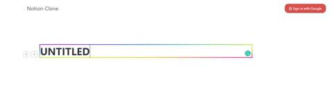

# Notion-Clone

## Introduction

This is a Notion-Clone that's built on top of MERN stack. I built it only because I like using Notion and thought it would fun to build one

 
 
 

Features: 
-   A Notion Editor that allows users to type, delete, insert a new block
-   Authentication via Oauth2
-   Drag and Drop blocks with react-beautiful-dnd
-  Select menu and Change Blocks

## Installation

git clone

npm run start in frontend 
